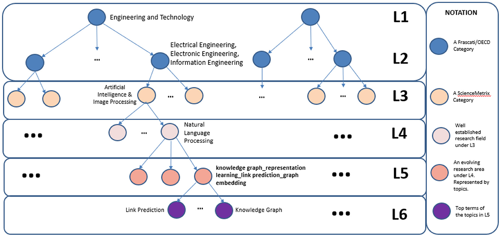

# SciNoBo Field of Science classification

This repository contains the code and the dockerfile for building the image and container responsible for the Field of Science classification of scientific publications. SciNoBo FoS is a novel classification system of publications to predefined Field of Science (FoS) taxonomies, leveraging the structural properties of a publication (citations, references) organized in a multilayer network. It offers a dynamically constructed FoS taxonomy, which can help ​​identify research trends of interest.

The classifier works with a dynamic hierarchical taxonomy. The taxonomy has 6 Levels (L1-L6). We classify each publications to Fields of Science labels from these labels. The levels from L1-L3 are static and stem from the OECD and ScienceMetrix taxonomy. The rest of the levels are algorithmically constructed utilizing publication-to-publications and venue-to-venue citation graph as well as clustering and topic modelling algorithms. To view all the FoS labels, please visit: [OpenAIRE FoS](https://explore.openaire.eu/fields-of-science). A snapshot of the taxonomy is visible below:

## Snapshot of the FoS taxonomy.

## Publications:
- [SCINOBO: a novel system classifying scholarly communication in a dynamically constructed hierarchical Field-of-Science taxonomy](https://www.frontiersin.org/articles/10.3389/frma.2023.1149834/full)
- [SciNoBo: A Hierarchical Multi-Label Classifier of Scientific Publications](https://dl.acm.org/doi/10.1145/3487553.3524677)

## Contents of repository
- input_files: Directory which contains test files for a demo. If you want to test the docker, then use this folder as the input volume to the docker when you run it. E.g. -v path/to/input_files:
- Dockerfile: Contains the commands for building the docker
- inference.py: Contains the code responsible for the inference procedure. This is the main script.
- input_schema.json: Example schema for how the input should be.
- L2_to_L1.json: Mapping from the L2 FoS fields to L1
- L3_to_L2.json: Mapping from the L3 FoS fields to L2
- L3_to_L4.json: Mapping from the L3 FoS fields to L4
- L4_to_L3.json: Mapping from the L4 FoS fields to L3
- my_graph.py: Contains the code for managing the inference graph of SciNoBo
- output_schema.json: Contains the output schema of the predictions
- requirements.txt: The python packages required.
- scinobo_inference_graph.p: The SciNoBo inference graph
- utils.py: Contains code for utilities
- venue_parser.py: Contains code for parsing the venue names
- venue_maps.p: Contains the abbreviations of the venues

# Commands to build and run the docker

## Create docker image
Use the following command to create a docker image.
The flag -t specifies the name of the image that will be created with an optional tag (for example its version).

`docker build --build-arg HF_TOKEN=<AUTHORIZED ORG HF TOKEN> --tag scinobo-fos:latest .`

- The name of the image in this case is scinobo-fos:latest.
- The location of the Dockerfile is the current directory.

## Run the FastAPI server for FoS
`docker run  --rm --name scinobo-fos-api -p 1997:1997 scinobo-fos conda run --no-capture-output -n docker_env uvicorn fos.server.api:app --host 0.0.0.0 --port 1997`

**NOTE**: scinobo-fos-api is the name of the container
**NOTE**: the docker is exposing only the port 1997
**NOTE**: the conda environment created through the dockerfile. You can change the name from the dockerfile.

## Run image container for bulk inference
To run a container with the bulk inference, the following command is needed:

`docker run <--rm> -i <--name CONTAINER-NAME> -v path/to/input/local/data:/input_files -v path/to/output/local/data:/output_files IMAGE-NAME python -m fos.pipeline.inference <args>`

## Flags:
- --rm: remove the container when execution ends. (optional)
- -i: set interactive mode. (optional)
- --name: a name for the container. (optional)
- v: volume binding. It maps a local directory to a directory inside the container so that local files can be accessed from it. The format is: /absolute/path/to/local/dir:/absolute/path/to/container/dir. You need to also specify a local directory where the docker will save the output

**Reminder**: If you want to test the docker, you need to use the following path as an input path --> -v path/to/input_files

## Example

`docker run  --rm --name scinobo-fos-bulk -v path/to/input/local/data/:/input_files -v path/to/output/local/data:/output_files scinobo-fos conda run --no-capture-output -n docker_env python -m fos.pipeline.inference --file_type="parquet"`

- **path/to/input/local/data/** --> where the input files exist in the host
- **path/to/output/local/data** --> a directory in the host where you want the container to save the output

## Miscellaneous
- **If you want to connect to the docker -->** `docker exec -it <container_name> /bin/bash`
- **If you want to see the logs of the docker -->** `docker logs <container_name>`
- **Copy the results of the docker to the host destination folder -->** `docker cp <container_name>: ./output_test_files ./`
